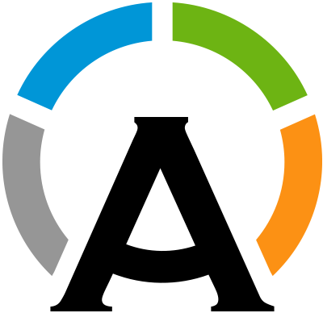

    <h1 align="center">Hi 👋, I'm TomeMD</h1>
    <h3 align="center">I'm a computer engineer specialized on IT management. </h3>

    

    
## 👨‍💻 About Me

📙 I have completed a Bachelor's degree in Computer Science and a Master's degree in High Performance Computing. 
📖 I'm currently carrying out my PhD on IT, about the management of CPU power consumption in container-based environments. 
📫 You can reach me at **tome.maseda@udc.es**.  
🌐 For more info check out my [website](https://tomemaseda.com) (not currently available). 
 

## 🔨 My main Languages and Tools

    
|                     Linux distributions                      |                    Programming languages                     |                        Cloud services                        |                          Containers                          |                            Tools                             |
| :----------------------------------------------------------: | :----------------------------------------------------------: | :----------------------------------------------------------: | :----------------------------------------------------------: | :----------------------------------------------------------: |
|  | &nbsp;&nbsp;&nbsp;&nbsp; |  |  &nbsp; | &nbsp;        &nbsp; |

 

## 🏅 My Stats

